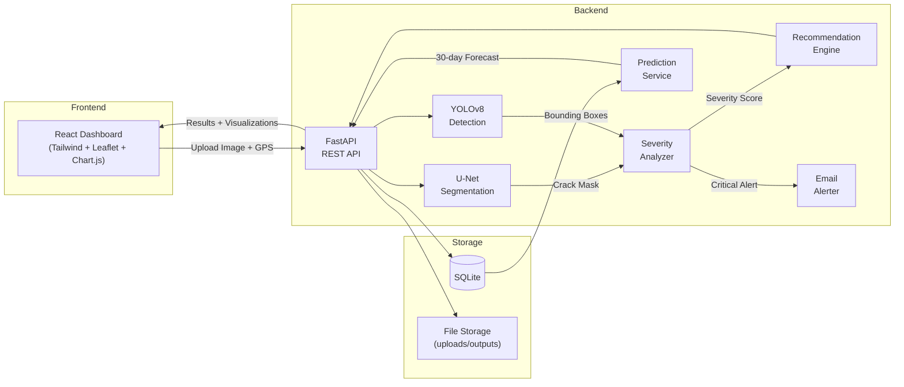

<<<<<<< HEAD
<div align="center">

#  DriveSafe Road Crack Detection System

### Autonomous road health monitoring

[](https://python.org)
[](https://pytorch.org)
[](https://fastapi.tiangolo.com)
[](https://docs.ultralytics.com)
[](https://react.dev)
[](LICENSE)

An end-to-end AI-powered platform that detects **road cracks** via semantic segmentation (U-Net), identifies **potholes** via object detection (YOLOv8), performs **rule-based severity analysis**, generates **maintenance recommendations**, and visualizes everything on a **real-time interactive dashboard** with GPS-based mapping.

---

[Features](#-features) · [Architecture](#-system-architecture) · [Tech Stack](#-tech-stack) · [Getting Started](#-getting-started) · [API Reference](#-api-reference) · [Project Structure](#-project-structure) · [License](#-license)

</div>

---

##  Features

| Module | Description |
|--------|-------------|
| **Crack Segmentation** | Pixel-level crack detection using a custom U-Net (PyTorch) trained on the Crack Segmentation Dataset |
| **Pothole Detection** | Real-time pothole identification via fine-tuned YOLOv8 with bounding box + confidence scores |
| **Severity Analysis** | Rule-based classification (Low / Medium / High / Critical) using crack length, width, and density metrics |
| **Maintenance Recommendations** | Automated repair suggestions generated from severity levels and damage patterns |
| **GPS Geo-Tagging** | Interactive Leaflet map with color-coded severity markers for spatial monitoring |
| **Early Warning & Prediction** | 30-day risk forecasting using regression on historical inspection records |
| **Email Alerts** | Automated email notifications for critical severity detections |
| **Modern Dashboard** | Premium dark-mode React UI with glassmorphism aesthetics, Chart.js analytics, and real-time updates |

---

## System Architecture



---

## Tech Stack

| Layer | Technology |
|-------|-----------|
| **Deep Learning** | PyTorch, Ultralytics YOLOv8 |
| **Model Architecture** | Custom U-Net (encoder-decoder), YOLOv8n |
| **Backend Framework** | FastAPI, Uvicorn |
| **Database** | SQLite (SQLAlchemy ORM) |
| **Frontend** | React 18 (CDN), Tailwind CSS, Leaflet.js, Chart.js |
| **Computer Vision** | OpenCV, Pillow, torchvision |
| **Training Utils** | Custom Dice/Focal/CE losses, data augmentation pipeline |

---

## Getting Started

### Prerequisites

- **Python 3.10+**
- **pip** (package manager)
- **Git**

### 1️Clone the Repository

```bash
git clone https://github.com/theparamvrsingh/DriveSafe-Road-crack-detection-system.git
cd DriveSafe-Road-crack-detection-system
```

### 2️ Create Virtual Environment

```bash
python -m venv .venv

# Windows (PowerShell)
.\.venv\Scripts\Activate.ps1

# Linux / macOS
source .venv/bin/activate
```

### 3️ Install Dependencies

```bash
pip install -r requirements.txt
```

### 4️Prepare Datasets (for training only)

Download and organize datasets into the following structure:

```
data/
├── train/
│   ├── images/
│   └── masks/
└── test/
    ├── images/
    └── masks/
```

**Recommended datasets:**

| Purpose | Dataset | Link |
|---------|---------|------|
| Crack Segmentation | Crack Segmentation Dataset | [Kaggle](https://www.kaggle.com/datasets/lakshaymiddha/crack-segmentation-dataset) |
| Crack Detection | CRACK500 | [GitHub](https://github.com/fyangneil/pavement-crack-detection) |
| Multi-class Severity | RDD2020 | [Official Site](https://rdd2020.sekilab.global/data/) |
| GPS-tagged Data | SUT-Crack | [Mendeley](https://data.mendeley.com/datasets/gsbmknrhkv/5) |

### 5️Train Models (optional — pre-trained weights included)

**Segmentation (U-Net):**
```bash
python train.py --data ./data --epochs 10 --batch-size 8 --image_size 448 --save-dir weights --num-classes 2
```

**Detection (YOLOv8):**
```bash
python training/train_detection.py
```

### 6️ Run the Application

**Quick start (PowerShell):**
```powershell
.\run.ps1
```

**Manual start:**
```bash
cd backend
uvicorn app.main:app --reload --host 0.0.0.0 --port 8000
```

### 7️ Open Dashboard

| Endpoint | URL |
|----------|-----|
|  Dashboard | `http://localhost:8000/` |
|  Health Check | `http://localhost:8000/api/health` |

---

##  API Reference

| Method | Endpoint | Description |
|--------|----------|-------------|
| `GET` | `/api/health` | System health check |
| `POST` | `/api/infer` | Run crack segmentation inference (multipart: `file`, optional `lat`, `lon`) |
| `POST` | `/api/pothole/detect` | Run pothole detection (multipart: `file`, optional `lat`, `lon`) |
| `GET` | `/api/records?limit=200` | Retrieve inspection history |
| `GET` | `/api/predict?lat=...&lon=...&horizon_days=30` | 30-day risk prediction |
| `GET` | `/api/predictions?limit=200` | Retrieve prediction history |

---

##  Project Structure

```
DriveSafe-Road-crack-detection-system/
├── backend/                    # FastAPI backend application
│   ├── app/
│   │   ├── api/                # REST API route handlers
│   │   │   ├── routes_infer.py       # Crack segmentation endpoints
│   │   │   ├── routes_pothole.py     # Pothole detection endpoints
│   │   │   ├── routes_predict.py     # Prediction endpoints
│   │   │   ├── routes_records.py     # Inspection history endpoints
│   │   │   └── routes_health.py      # Health check
│   │   ├── services/           # Business logic layer
│   │   │   ├── segmentation.py       # U-Net inference pipeline
│   │   │   ├── severity.py           # Rule-based severity analysis
│   │   │   ├── recommendation.py     # Maintenance recommendations
│   │   │   ├── prediction.py         # Time-series risk prediction
│   │   │   ├── model_loader.py       # Model weight management
│   │   │   ├── emailer.py            # Email alert service
│   │   │   └── baseline.py           # Classical fallback segmenter
│   │   ├── db/                 # Database layer (SQLite + SQLAlchemy)
│   │   ├── models/             # ORM models
│   │   └── schemas/            # Pydantic schemas
│   └── storage/                # Persisted uploads & inference outputs
├── frontend/                   # React dashboard (CDN, no build step)
│   ├── index.html              # Entry point
│   ├── app.js                  # React application logic
│   └── style.css               # Custom styles + glassmorphism
├── models/                     # Neural network architectures
│   └── unet.py                 # Custom U-Net implementation
├── training/                   # Training scripts
│   ├── train_segmentation.py   # U-Net training loop
│   └── train_detection.py      # YOLOv8 fine-tuning
├── utils/                      # Shared utilities
│   ├── dataset.py              # PyTorch dataset loaders
│   ├── losses.py               # Dice, Focal, CrossEntropy losses
│   ├── functional.py           # Image processing functions
│   └── general.py              # General helpers
├── weights/                    # Pre-trained model weights
│   ├── best_segmentation.pt    # Trained U-Net weights
│   └── best_detection.pt       # Trained YOLOv8 weights
├── assets/                     # Sample images for testing
├── scripts/                    # Utility scripts
├── train.py                    # Main segmentation training entry point
├── inference.py                # Standalone inference script
├── run.ps1                     # One-click launcher (Windows)
├── requirements.txt            # Python dependencies
├── .gitignore
└── LICENSE                     # MIT License
```

---

## Model Performance

| Model | Task | Metric | Score |
|-------|------|--------|-------|
| U-Net | Crack Segmentation | Dice Score | ~0.85 |
| U-Net | Crack Segmentation | Validation Loss | ~0.18 |
| YOLOv8 | Pothole Detection | mAP@50 | ~0.78 |
| YOLOv8 | Pothole Detection | Precision | ~0.82 |

---

##  Notes

- If `weights/best_segmentation.pt` is missing, the backend falls back to a classical baseline segmenter so the UI remains fully functional.
- Uploads and inference outputs are persisted under `backend/storage/` and served at `/storage` for traceability.
- The frontend uses React via CDN with Babel transpilation — no `npm install` or build step required.

---

##  License

This project is licensed under the MIT License — see the [LICENSE](LICENSE) file for details.

---

<div align="center">

**Smarter, safer roads.**

</div>
=======
# DriveSafe
>>>>>>> eef9d0f1a30ced9a7937333bcfa8a110c39f17de
